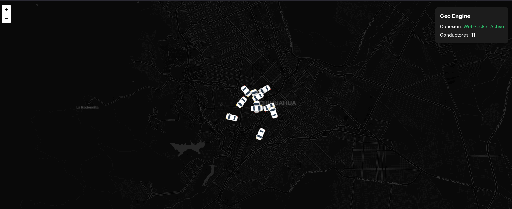

# 🌍 Geo Engine Core


**Geo Engine Core** is a high-performance, real-time geospatial tracking system. It combines a robust **Golang** backend capable of complex spatial event detection with a modern **React** dashboard for live visualization and dynamic geofence management.

## 📸 Dashboard Preview



> *Real-time visualization of geofences and vehicle tracking.*

---

## ⚡ Key Features

### ⚙️ Backend ( The Engine )
* **Spatial Intelligence:** Uses **PostGIS** algorithms (`ST_Contains`, `ST_Intersects`) to detect vehicle entries/exits in irregular polygons with sub-millisecond precision.
* **Event Sourcing:** Every spatial event is transactionally recorded in **PostgreSQL** for audit trails and analytics.
* **High Concurrency:** Built with Go routines to handle thousands of concurrent driver updates and write operations without blocking.
* **State Management:** Uses **Redis** for ephemeral state caching to prevent alert duplication (signal bouncing).

### 💻 Frontend ( The Control Tower )
* **Custom Vector Editor:** A bespoke drawing engine built on Leaflet allowing users to create zones and fine-tune shapes using **draggable vertex markers**.
* **Real-Time Updates:** WebSocket integration for sub-second latency updates (<50ms) of vehicle positions and alerts.
* **Modern UX:** Glassmorphism UI design with non-intrusive toast notifications and a reactive state model.

---

## 🛠️ System Architecture

1.  **Ingestion:** Devices/Simulators send coordinates via HTTP/UDP.
2.  **Processing:** Go backend calculates spatial relationships.
3.  **Persistence:** History stored in Postgres; Hot state in Redis.
4.  **Broadcast:** WebSockets push updates to connected clients.
5.  **Visualization:** React renders the map and manages user interaction.

---

## 🚀 Quick Start (Docker)

The easiest way to run the full stack is using Docker Compose.

1. **Clone the repository:**
```bash
   git clone https://github.com/AlexG695/geo-engine-core.git
   cd geo-engine-core

```

2. **Start services:**
```bash
docker-compose up --build

```


3. **Access the App:**
* **Frontend:** [http://localhost:5173](https://www.google.com/search?q=http://localhost:5173)
* **Backend API:** [http://localhost:8080](https://www.google.com/search?q=http://localhost:8080)


---

## 🧪 Testing Strategy

This project maintains a high standard of code quality through automated testing.

* **Backend Integration:** Validates PostGIS queries and concurrent writes.
* **Frontend UI:** Validates component rendering and state logic using Vitest.

```bash
# Run all tests
make test

```

---

## 📂 Project Structure

* `backend/` - Golang API, SQLC queries, and migration files. [Read more](https://www.google.com/search?q=./backend/README.md)
* `frontend/` - React Application, Leaflet logic, and styles. [Read more](https://www.google.com/search?q=./frontend/README.md)


## 🛠️ Developer Commands (Makefile)

This project includes a Makefile to simplify common tasks:

| Command | Description |
| :--- | :--- |
| `make up` | Starts the full stack (Docker). |
| `make test` | Runs both Backend and Frontend tests. |
| `make sqlc` | Regenerates Go code from SQL queries. |
| `make migrate-up` | Applies database migrations. |